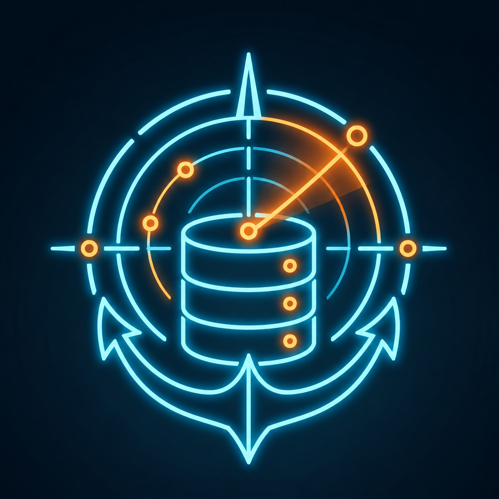

<p align="center">
  
</p>

<h1 align="center">Recon</h1>

<p align="center">
  A local-first database client for macOS. Recon connects to MySQL, PostgreSQL, and SQLite with drivers built into the app, so there is nothing else to install. Passwords live in the macOS Keychain.
</p>

<p align="center">
  <a href="https://github.com/fylzero/recon/releases/latest/download/Recon-macos-arm64.dmg"></a>
  <a href="https://buymeacoffee.com/fylzero1"></a>
</p>

## First-time setup

Recon is a [Tauri](https://v2.tauri.app/) app: a Vue frontend plus a Rust native shell. You need **Node**, **Rust**, and **Xcode Command Line Tools** before `npm run tauri dev` will work.

### 1. Clone the repo

```bash
git clone https://github.com/fylzero/recon.git
cd recon
```

### 2. Xcode Command Line Tools

These provide the C/C++ compiler Rust uses on macOS.

```bash
xcode-select --install
```

If that says they are already installed, you are fine. Confirm with:

```bash
xcode-select -p
```

### 3. Node.js 20+

Install from [nodejs.org](https://nodejs.org/) or Homebrew:

```bash
brew install node
node -v   # v20 or newer
```

### 4. Rust

Tauri compiles the native app with `cargo`. Install the official toolchain with [rustup](https://www.rust-lang.org/tools/install):

```bash
curl --proto '=https' --tlsv1.2 -sSf https://sh.rustup.rs | sh
```

Accept the defaults, then **open a new terminal** and confirm:

```bash
cargo --version
```

`npm run tauri dev` already prepends `$HOME/.cargo/bin` to `PATH`.

### 5. Install JS dependencies and start the app

```bash
npm install
npm run tauri dev
```

That command:

1. Starts Vite on `http://localhost:1420` for the Vue UI
2. Compiles the Rust/Tauri shell
3. Opens the native Recon window

The **first** `tauri dev` (or `tauri build`) downloads crates and compiles from scratch, including the MySQL, PostgreSQL, and SQLite drivers. That often takes several minutes. Later runs are much faster.

## Supported databases

| Database | Connection details |
| --- | --- |
| MySQL / MariaDB | Host, port (3306), user, password, database, SSL mode |
| PostgreSQL | Host, port (5432), user, password, database, SSL mode |
| SQLite | A database file on disk (Recon can create a new one) |

## Export a native Mac app

```bash
npm run tauri build
```

| Artifact | Path |
| --- | --- |
| App bundle | `src-tauri/target/release/bundle/macos/Recon.app` |
| Disk image | `src-tauri/target/release/bundle/dmg/Recon_0.1.0_aarch64.dmg` |

macOS Gatekeeper may warn that an unsigned local build is unidentified: right-click the app, choose **Open**, then confirm.

## Publishing signed releases

See [macOS release setup](docs/macos-releases.md) for Apple enrollment, repository
secrets, and the signing and notarization checks required by the Release workflow.

## Troubleshooting

**`failed to run 'cargo metadata' ... No such file or directory (os error 2)`**  
Rust is not installed. Run step 4, open a new terminal, and confirm `command -v cargo` prints `/Users/<you>/.cargo/bin/cargo`.

**`xcrun: error: invalid active developer path`**  
Xcode Command Line Tools are missing or stale. Run `xcode-select --install`.

**Frontend only (browser, no native APIs)**  
`npm run dev` serves the Vue app at `http://localhost:1420`. Database connections, dialogs, and other Tauri APIs need `npm run tauri dev`.
